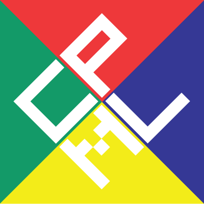

化学・物理メーリングリストです。

1994年4月以来、化学と物理にまたがる[研究](/研究)会情報や公募情報を流しています。

2007年頃より、物理学会領域12の連絡用にも利用されています。

* どなたでも参加できます。
* メンバーは情報を投稿することもできます。
* [ウェブインターフェース](https://docs.google.com/forms/d/e/1FAIpQLSd2F2tL8LMlaEYoYZ10ehpBthJ45e5sblT8YMWwL7azeCoZ5g/viewform)からの投稿をお薦めします。
  * イベント開催期間や締切を[CPMLカレンダー](https://calendar.google.com/calendar/embed?src=o0crucuhclcj9mk4vm93ci19es%40group.calendar.google.com&ctz=Asia%2FTokyo)に自動的に掲載します。
  * メーリングリストには流さず、カレンダーのみに掲示することもできます。
* 従来通り、[メールで投稿](mailto:cpml@okayama-u.ac.jp)することもできます。

## 参加方法

[cpml-subscribe@okayama-u.ac.jp](mailto:cpml-subscribe@okayama-u.ac.jp) にメールを送信して下さい。(題名・本文は不要です)

## 退会方法

[cpml-leave@okayama-u.ac.jp](mailto:cpml-leave@okayama-u.ac.jp) にメールを送信してください。(題名・本文は不要です)

## [ウェブインターフェース](https://docs.google.com/forms/d/e/1FAIpQLSd2F2tL8LMlaEYoYZ10ehpBthJ45e5sblT8YMWwL7azeCoZ5g/viewform)のしくみ

* Google Formsで入力された内容は、[FormApprovals](https://formapprovals.com/)を使って、管理者が検収します。投稿内容に問題がなければ、これを受け入れます。
* 投稿内容はGoogle Spreadsheetに記録されます。(Google Formsの仕様)
* [Google Apps Script](https://script.google.com/)の`updateEvents`を利用して5分ごとに新しい投稿をチェックし、投稿があればメーリングリストに転送し、日程をGoogle Calendarに書き込みます。

## Linked from

* [CPML](/CPML)
* [CPML用掲示板の検討](/CPML用掲示板の検討)
* [FrontPage](/FrontPage)
* [Menu](/Menu)
* [ロゴマーク](/ロゴマーク)

----

[Edit](https://github.com/vitroid/vitroid.github.io/edit/master/MD/CPML.md)

